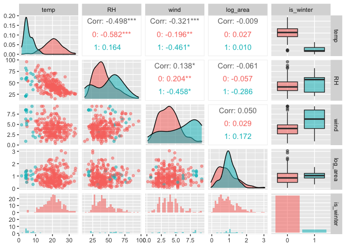

Foret Fires RMarkdown
================

``` r
#Load libraries

library(ggplot2)
library(dplyr)
```

    ## 
    ## Attaching package: 'dplyr'

    ## The following objects are masked from 'package:stats':
    ## 
    ##     filter, lag

    ## The following objects are masked from 'package:base':
    ## 
    ##     intersect, setdiff, setequal, union

``` r
library(GGally)
```

    ## Registered S3 method overwritten by 'GGally':
    ##   method from   
    ##   +.gg   ggplot2

``` r
library(caret)
```

    ## Loading required package: lattice

``` r
#Load and name forestfires.tsv file

setwd("~/Documents/RStudio_Uploads/Forest_Fires_data_analysis")
ff = read.delim('forestfires.tsv', header = TRUE, sep = '\t')
forestfires <- ff
```

``` r
#skim ff file

head(ff)
```

    ##   X Y month day FFMC  DMC    DC  ISI temp RH wind rain area
    ## 1 7 5   mar fri 86.2 26.2  94.3  5.1  8.2 51  6.7  0.0    0
    ## 2 7 4   oct tue 90.6 35.4 669.1  6.7 18.0 33  0.9  0.0    0
    ## 3 7 4   oct sat 90.6 43.7 686.9  6.7 14.6 33  1.3  0.0    0
    ## 4 8 6   mar fri 91.7 33.3  77.5  9.0  8.3 97  4.0  0.2    0
    ## 5 8 6   mar sun 89.3 51.3 102.2  9.6 11.4 99  1.8  0.0    0
    ## 6 8 6   aug sun 92.3 85.3 488.0 14.7 22.2 29  5.4  0.0    0

``` r
tail(ff)
```

    ##     X Y month day FFMC   DMC    DC  ISI temp RH wind rain  area
    ## 512 8 6   aug sun 81.6  56.7 665.6  1.9 27.8 35  2.7    0  0.00
    ## 513 4 3   aug sun 81.6  56.7 665.6  1.9 27.8 32  2.7    0  6.44
    ## 514 2 4   aug sun 81.6  56.7 665.6  1.9 21.9 71  5.8    0 54.29
    ## 515 7 4   aug sun 81.6  56.7 665.6  1.9 21.2 70  6.7    0 11.16
    ## 516 1 4   aug sat 94.4 146.0 614.7 11.3 25.6 42  4.0    0  0.00
    ## 517 6 3   nov tue 79.5   3.0 106.7  1.1 11.8 31  4.5    0  0.00

``` r
#Convert X and Y coordinates to factor variable

ff$X = factor(ff$X)
ff$Y = factor(ff$Y)

#Create log_area for for a more even distribution of data for analysis
ff$log_area = log10(ff$area + 1)
```

    ##   X Y month day FFMC  DMC    DC  ISI temp RH wind rain area log_area is_winter
    ## 1 7 5   mar fri 86.2 26.2  94.3  5.1  8.2 51  6.7  0.0    0        0         0
    ## 2 7 4   oct tue 90.6 35.4 669.1  6.7 18.0 33  0.9  0.0    0        0         0
    ## 3 7 4   oct sat 90.6 43.7 686.9  6.7 14.6 33  1.3  0.0    0        0         0
    ## 4 8 6   mar fri 91.7 33.3  77.5  9.0  8.3 97  4.0  0.2    0        0         0
    ## 5 8 6   mar sun 89.3 51.3 102.2  9.6 11.4 99  1.8  0.0    0        0         0
    ## 6 8 6   aug sun 92.3 85.3 488.0 14.7 22.2 29  5.4  0.0    0        0         0

    ##        X      Y          month               day                 FFMC      
    ##  4      :91   2: 44   Length:517         Length:517         Min.   :18.70  
    ##  6      :86   3: 64   Class :character   Class :character   1st Qu.:90.20  
    ##  2      :73   4:203   Mode  :character   Mode  :character   Median :91.60  
    ##  8      :61   5:125                                         Mean   :90.64  
    ##  7      :60   6: 74                                         3rd Qu.:92.90  
    ##  3      :55   8:  1                                         Max.   :96.20  
    ##  (Other):91   9:  6                                                        
    ##       DMC              DC             ISI              temp      
    ##  Min.   :  1.1   Min.   :  7.9   Min.   : 0.000   Min.   : 2.20  
    ##  1st Qu.: 68.6   1st Qu.:437.7   1st Qu.: 6.500   1st Qu.:15.50  
    ##  Median :108.3   Median :664.2   Median : 8.400   Median :19.30  
    ##  Mean   :110.9   Mean   :547.9   Mean   : 9.022   Mean   :18.89  
    ##  3rd Qu.:142.4   3rd Qu.:713.9   3rd Qu.:10.800   3rd Qu.:22.80  
    ##  Max.   :291.3   Max.   :860.6   Max.   :56.100   Max.   :33.30  
    ##                                                                  
    ##        RH              wind            rain              area        
    ##  Min.   : 15.00   Min.   :0.400   Min.   :0.00000   Min.   :   0.00  
    ##  1st Qu.: 33.00   1st Qu.:2.700   1st Qu.:0.00000   1st Qu.:   0.00  
    ##  Median : 42.00   Median :4.000   Median :0.00000   Median :   0.52  
    ##  Mean   : 44.29   Mean   :4.018   Mean   :0.02166   Mean   :  12.85  
    ##  3rd Qu.: 53.00   3rd Qu.:4.900   3rd Qu.:0.00000   3rd Qu.:   6.57  
    ##  Max.   :100.00   Max.   :9.400   Max.   :6.40000   Max.   :1090.84  
    ##                                                                      
    ##     log_area        is_winter      
    ##  Min.   :0.0000   Min.   :0.00000  
    ##  1st Qu.:0.0000   1st Qu.:0.00000  
    ##  Median :0.1818   Median :0.00000  
    ##  Mean   :0.4825   Mean   :0.05996  
    ##  3rd Qu.:0.8791   3rd Qu.:0.00000  
    ##  Max.   :3.0382   Max.   :1.00000  
    ## 

    ##  [1] "factor"              "integer"             "oldClass"           
    ##  [4] "double"              "numeric"             "vector"             
    ##  [7] "data.frameRowLabels" "atomicVector"        "index"              
    ## [10] "replValue"           "numLike"             "number"             
    ## [13] "replValueSp"

    ## `stat_bin()` using `bins = 30`. Pick better value with `binwidth`.
    ## `stat_bin()` using `bins = 30`. Pick better value with `binwidth`.
    ## `stat_bin()` using `bins = 30`. Pick better value with `binwidth`.
    ## `stat_bin()` using `bins = 30`. Pick better value with `binwidth`.

<!-- -->

``` r
#Split Data into test and train sets
in_train = createDataPartition(y = ff$log_area, p = 0.80, list = FALSE)

head(in_train)
```

    ##      Resample1
    ## [1,]         1
    ## [2,]         2
    ## [3,]         3
    ## [4,]         5
    ## [5,]         6
    ## [6,]         8

``` r
#Display all columns in both training and test sets
ff_train = ff[in_train, ]
ff_test = ff[-in_train, ]


#Pre-processing steps, centering and scaling

preprocessing_steps = preProcess(select(ff, FFMC,DMC, DC, ISI, temp, RH, wind, rain),
                                 method = c('center', 'scale'))

ff_train_processing = predict(preprocessing_steps, newdata = ff_train)
head(ff_train_processing)
```

    ##   X Y month day         FFMC        DMC         DC        ISI       temp
    ## 1 7 5   mar fri -0.805179637 -1.3220451 -1.8287056 -0.8601125 -1.8408572
    ## 2 7 4   oct tue -0.008094195 -1.1783995  0.4884179 -0.5091951 -0.1531300
    ## 3 7 4   oct sat -0.008094195 -1.0488061  0.5601729 -0.5091951 -0.7386680
    ## 5 8 6   mar sun -0.243596712 -0.9301423 -1.7968593  0.1268427 -1.2897626
    ## 6 8 6   aug sun  0.299870636 -0.3992778 -0.2416292  1.2453920  0.5701817
    ## 8 8 6   aug mon  0.154946010  0.5391031  0.2429189  0.3680985 -1.8753006
    ##           RH       wind        rain area log_area is_winter
    ## 1  0.4113260  1.4971644 -0.07319742    0        0         0
    ## 2 -0.6917863 -1.7400703 -0.07319742    0        0         0
    ## 3 -0.6917863 -1.5168128 -0.07319742    0        0         0
    ## 5  3.3529586 -1.2377408 -0.07319742    0        0         0
    ## 6 -0.9369223  0.7715773 -0.07319742    0        0         0
    ## 8  2.5562664 -1.0144832 -0.07319742    0        0         0

``` r
ff_test_processing = predict(preprocessing_steps, newdata = ff_test)
head(ff_test_processing)
```

    ##    X Y month day        FFMC        DMC         DC         ISI       temp
    ## 4  8 6   mar fri  0.19117717 -1.2111882 -1.8964295 -0.00475130 -1.8236355
    ## 7  8 6   aug mon  0.29987064 -0.3430687 -0.2109922 -0.11441300  0.8973942
    ## 13 6 5   aug fri -4.91741590 -0.6256759  0.4730994 -1.80320311 -0.3253470
    ## 15 6 5   sep wed  0.40856411  0.3501779  0.6113689  0.03911338  1.2934934
    ## 21 6 4   sep tue  0.06436812  0.2908459  0.5831507 -0.44339808 -0.1014648
    ## 31 6 3   sep fri  0.66218220 -0.4024006  0.5819413  1.50858011  1.1212764
    ##            RH         wind        rain area log_area is_winter
    ## 4   3.2303906 -0.009824197  0.60257159    0        0         0
    ## 7  -1.0594903 -0.512153722 -0.07319742    0        0         0
    ## 13  1.6982902  1.497164378 -0.07319742    0        0         0
    ## 15 -1.4271944  0.269247762 -0.07319742    0        0         0
    ## 21 -0.2627982 -0.735411288 -0.07319742    0        0         0
    ## 31 -1.2433424 -0.233081763 -0.07319742    0        0         0

``` r
help(predict)

#Near zero variances

nearZeroVar(ff_train_processing, saveMetrics = TRUE)
```

    ##            freqRatio percentUnique zeroVar   nzv
    ## X           1.000000     2.1634615   FALSE FALSE
    ## Y           1.676768     1.4423077   FALSE FALSE
    ## month       1.134328     2.8846154   FALSE FALSE
    ## day         1.014085     1.6826923   FALSE FALSE
    ## FFMC        1.150000    24.0384615   FALSE FALSE
    ## DMC         1.285714    46.8750000   FALSE FALSE
    ## DC          1.125000    47.3557692   FALSE FALSE
    ## ISI         1.052632    28.1250000   FALSE FALSE
    ## temp        1.142857    44.2307692   FALSE FALSE
    ## RH          1.173913    17.3076923   FALSE FALSE
    ## wind        1.048780     5.0480769   FALSE FALSE
    ## rain      410.000000     1.6826923   FALSE  TRUE
    ## area       65.666667    49.5192308   FALSE FALSE
    ## log_area   65.666667    49.5192308   FALSE FALSE
    ## is_winter  15.640000     0.4807692   FALSE FALSE

``` r
table(ff_train_processing$rain)
```

    ## 
    ## -0.0731974161662176   0.602571586654042     1.2783405894743    2.62987859511482 
    ##                 410                   1                   1                   1 
    ##    3.30564759793508     4.6571856035756    21.5514106740821 
    ##                   1                   1                   1

``` r
#Update to pre-processing steps above to remove near zero variance variables

preprocessing_steps = preProcess(select(ff, FFMC,DMC, DC, ISI, temp, RH, wind, rain),
                                 method = c('center', 'scale', 'nzv'))

ff_train_processing = predict(preprocessing_steps, newdata = ff_train)
head(ff_train_processing)
```

    ##   X Y month day         FFMC        DMC         DC        ISI       temp
    ## 1 7 5   mar fri -0.805179637 -1.3220451 -1.8287056 -0.8601125 -1.8408572
    ## 2 7 4   oct tue -0.008094195 -1.1783995  0.4884179 -0.5091951 -0.1531300
    ## 3 7 4   oct sat -0.008094195 -1.0488061  0.5601729 -0.5091951 -0.7386680
    ## 5 8 6   mar sun -0.243596712 -0.9301423 -1.7968593  0.1268427 -1.2897626
    ## 6 8 6   aug sun  0.299870636 -0.3992778 -0.2416292  1.2453920  0.5701817
    ## 8 8 6   aug mon  0.154946010  0.5391031  0.2429189  0.3680985 -1.8753006
    ##           RH       wind area log_area is_winter
    ## 1  0.4113260  1.4971644    0        0         0
    ## 2 -0.6917863 -1.7400703    0        0         0
    ## 3 -0.6917863 -1.5168128    0        0         0
    ## 5  3.3529586 -1.2377408    0        0         0
    ## 6 -0.9369223  0.7715773    0        0         0
    ## 8  2.5562664 -1.0144832    0        0         0

``` r
ff_test_processing = predict(preprocessing_steps, newdata = ff_test)
head(ff_test_processing)
```

    ##    X Y month day        FFMC        DMC         DC         ISI       temp
    ## 4  8 6   mar fri  0.19117717 -1.2111882 -1.8964295 -0.00475130 -1.8236355
    ## 7  8 6   aug mon  0.29987064 -0.3430687 -0.2109922 -0.11441300  0.8973942
    ## 13 6 5   aug fri -4.91741590 -0.6256759  0.4730994 -1.80320311 -0.3253470
    ## 15 6 5   sep wed  0.40856411  0.3501779  0.6113689  0.03911338  1.2934934
    ## 21 6 4   sep tue  0.06436812  0.2908459  0.5831507 -0.44339808 -0.1014648
    ## 31 6 3   sep fri  0.66218220 -0.4024006  0.5819413  1.50858011  1.1212764
    ##            RH         wind area log_area is_winter
    ## 4   3.2303906 -0.009824197    0        0         0
    ## 7  -1.0594903 -0.512153722    0        0         0
    ## 13  1.6982902  1.497164378    0        0         0
    ## 15 -1.4271944  0.269247762    0        0         0
    ## 21 -0.2627982 -0.735411288    0        0         0
    ## 31 -1.2433424 -0.233081763    0        0         0

``` r
nearZeroVar(ff_train_processing, saveMetrics = TRUE)
```

    ##           freqRatio percentUnique zeroVar   nzv
    ## X          1.000000     2.1634615   FALSE FALSE
    ## Y          1.676768     1.4423077   FALSE FALSE
    ## month      1.134328     2.8846154   FALSE FALSE
    ## day        1.014085     1.6826923   FALSE FALSE
    ## FFMC       1.150000    24.0384615   FALSE FALSE
    ## DMC        1.285714    46.8750000   FALSE FALSE
    ## DC         1.125000    47.3557692   FALSE FALSE
    ## ISI        1.052632    28.1250000   FALSE FALSE
    ## temp       1.142857    44.2307692   FALSE FALSE
    ## RH         1.173913    17.3076923   FALSE FALSE
    ## wind       1.048780     5.0480769   FALSE FALSE
    ## area      65.666667    49.5192308   FALSE FALSE
    ## log_area  65.666667    49.5192308   FALSE FALSE
    ## is_winter 15.640000     0.4807692   FALSE FALSE

``` r
preprocessing_steps
```

    ## Created from 517 samples and 8 variables
    ## 
    ## Pre-processing:
    ##   - centered (7)
    ##   - ignored (0)
    ##   - removed (1)
    ##   - scaled (7)

``` r
#The rain variable was removed for near zero variance.
```
